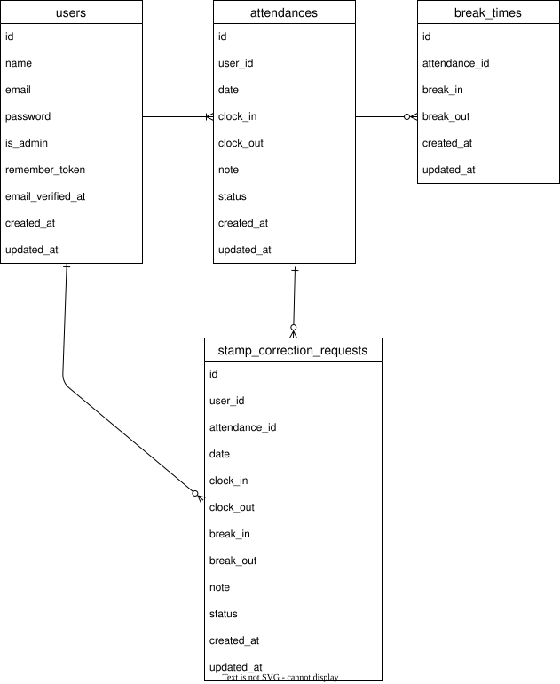

# KintaiManager(coachtech 勤怠管理アプリ)

## セットアップ（Docker）

```
# 1) リポジトリ取得
git clone git@github.com:asamiwatababe/KintaiManager.git
cd KintaiManager

# 2) コンテナ起動（Docker Compose v2）
docker-compose up -d --build
# ※ 旧環境: docker-compose up -d --build
```

## Laravel環境構築

以降の composer / artisan は PHPコンテナ内 で実行します。
```
# PHPコンテナに入る
docker compose exec php bash
# 旧: docker-compose exec php bash

# 依存インストール
composer install

# 環境ファイル
cp .env.example .env

# .env（DB設定の例：docker-compose.yml に合わせる）
# APP_URL=http://localhost
# DB_CONNECTION=mysql
# DB_HOST=mysql
# DB_PORT=3306
# DB_DATABASE=laravel_db
# DB_USERNAME=laravel_user
# DB_PASSWORD=laravel_pass

# アプリキー発行
php artisan key:generate

# マイグレーション & 初期データ投入
php artisan migrate --seed
```

## 開発環境
- 会員登録画面：[http://localhost/register]
- ログイン画面：[http://localhost/login]
- phpMyAdmin: http://localhost:8080

## 使用技術（実行環境）
Laravel 8.75 / PHP 7.4.9
MySQL 8.0.26
Docker / Docker Compose
GitHub
phpMyAdmin

## ER図


## テストアカウント（Seeder で作成済み）

一般ユーザー（2名）
- name: 山田太郎
- email: yamada@example.com
- password: password

- name: 鈴木花子
- email: suzuki@example.com
- password: password

管理者ユーザー
- name: 管理者
- email: admin@example.com
- password: password

//まだ投入していない場合は PHPコンテナ内で
php artisan db:seed --class=DemoDataSeeder を実行してください。
これらのアカウントは email_verified_at 済みです。

## PHPUnit を利用したテスト

以降は PHPコンテナ内 で実行します。


### テスト用データベースの作成
```bash
# root パスワードは docker-compose.yml の MYSQL_ROOT_PASSWORD を使用
docker compose exec mysql sh -lc \
'mysql -uroot -p"$MYSQL_ROOT_PASSWORD" \
 -e "CREATE DATABASE IF NOT EXISTS test_database CHARACTER SET utf8mb4 COLLATE utf8mb4_unicode_ci;"'
```

### .env.testing を用意
```
cp -n .env .env.testing
```
//.env.testing を開いて テストDB向けに調整してください
```
APP_ENV=testing
APP_URL=http://localhost

DB_CONNECTION=mysql
DB_HOST=mysql                 # MySQL コンテナのサービス名
DB_PORT=3306
DB_DATABASE=test_database     # 上で作成した DB 名
DB_USERNAME=laravel_user      # docker-compose.yml の MYSQL_USER と一致
DB_PASSWORD=laravel_pass      # docker-compose.yml の MYSQL_PASSWORD と一致

CACHE_DRIVER=array
SESSION_DRIVER=array
QUEUE_CONNECTION=sync
MAIL_MAILER=log               # メールはログ出力
```

//キー発行 & マイグレーション（テストDB）
```
php artisan key:generate --env=testing
php artisan migrate:fresh --seed --env=testing
```

//テスト実行
```
php artisan test --env=testing
# 高速化する場合
php artisan test --env=testing --parallel
```

## ダミーデータ
このリポジトリにはダミーデータ Seeder を用意しています。

```bash
# PHP コンテナ内で実行
php artisan migrate:fresh --seed
# もしくは DemoDataSeeder のみを実行
php artisan db:seed --class=DemoDataSeeder
```
